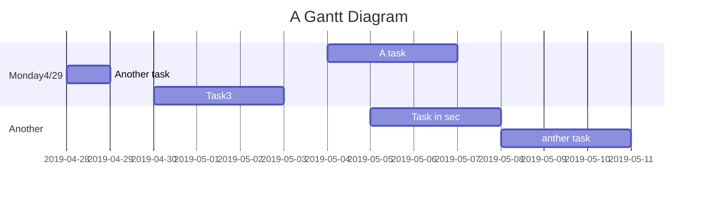

WikiCards
===

## Table of Contents
===
* [Description](#description)
* [Setup/Installation Requirements](#setup-installation-requirements)
* [Current Github Repository](#complete and in queue)
* [Known Bugs](#known-bugs)
* [Technologies Used](#technologies-used)
* [Support](#support)
* [License](#license)
## BDD/TDD

## Beginners Guide

If you are a total beginner to this, start here!

Visit [WikiCards App](https://wikicards.herokuapp.com/)
<pre>
1. Enter in your topic in Search Bar & click Submit
2. To Save Search click "Save"
3. Choose a way to save flashcard
4. Start personalizing your collection of deck stacks of your very own flashcards!
</pre>
Repo at [WikiCards Github](https://github.com/QuietEvolver/wikicards) 
<pre>
a. Navigate to Command Line Interface
b. From CLI, add packages $:
    npm install -y
    npm install axios
    npm install babel-cli
    npm install express
    npm install morgan
    npm install mongoose
    npm install node-dandelion (*if there are other dependencies such as es-lint,typescript(react.app), they will have to be personally installed)
    npm install nodemon
    npm install cors
    npm install react-router-dom//client
    npm install react-dom //client
    npm dotenv
</pre>    

## App Project Structure (*WIP)
```
|-- server/
|  |-- server.js                            // The entry point for running the backend server locally, and main server for production
|  |-- passport/                             // Configuration files used to connect to different machines or set settings
|     |-- index.js                     // Overloads the passport object and defines serialize and deserialize
|     |-- localStrategy.js            // Defines a local strategy
|     |-- googleStrategy.js           // Defines google OAuth stratgey
|     ....
|  |-- db/                             
|     |-- index.js                  // Configures the connection to the database
|     |-- models/                   // represents data from our database, and defines schemas for each collection
|        |-- user.js                // Schema for the User collection
| -- src/                           // Entry for the React client side application
```

User story
---

```gherkin=
Feature: View results of an entered topic 

  # The first example has two steps
  Scenario: User enters in a topic of choice
    When upon visiting the home page, inputs a topic and clicks the 'Submit' button,
    Then app renders entered text with synopsis and image of topi

  # The second example has three steps
  Scenario: Breaker joins a game
    Given the Maker has started a game with the word "silky"
    When the Breaker joins the Maker's game
    Then the Breaker must guess a word with 5 characters
```
> I choose a lazy person to do a hard job. Because a lazy person will find an easy way to do it. [name=Bill Gates]


```gherkin=
Feature: Shopping Cart
  As a Shopper
  I want to put items in my shopping cart
  Because I want to manage items before I check out

  Scenario: User adds item to cart
    Given I'm a logged-in User
    When I go to the Item page
    And I click "Add item to cart"
    Then the quantity of items in my cart should go up
    And my subtotal should increment
    And the warehouse inventory should decrement
```

> Read more about Gherkin here: https://docs.cucumber.io/gherkin/reference/

User flows
---
```sequence
App->User: Hello, Please enter in a topic
Note right of User: User thinks
User-->App: < topic: 'Mona Lisa' entered >!
Note left of App: App responds
App->User: Title:'Mona Lisa'\n Annotation: "abstract text.."\n Image: " {thumbnail icon shown}"
```

> Read more about sequence-diagrams here: http://bramp.github.io/js-sequence-diagrams/

Project Timeline
---


> Read more about mermaid here: http://knsv.github.io/mermaid/
>

## Appendix and FAQ

:::info
**Find this document incomplete?** Leave a comment!
:::

###### tags: `Templates` `Documentation`

This project was bootstrapped with [Create React App](https://github.com/facebook/create-react-app).

## Available Scripts

In the project directory, you can run:

### `npm start`

Runs the app in the development mode.<br>
Open [http://localhost:3000](http://localhost:3000) to view it in the browser.

The page will reload if you make edits.<br>
You will also see any lint errors in the console.

### `npm test`

Launches the test runner in the interactive watch mode.<br>
See the section about [running tests](https://facebook.github.io/create-react-app/docs/running-tests) for more information.

### `npm run build`

Builds the app for production to the `build` folder.<br>
It correctly bundles React in production mode and optimizes the build for the best performance.

The build is minified and the filenames include the hashes.<br>
Your app is ready to be deployed!

See the section about [deployment](https://facebook.github.io/create-react-app/docs/deployment) for more information.

### `npm run eject`

**Note: this is a one-way operation. Once you `eject`, you can’t go back!**

If you aren’t satisfied with the build tool and configuration choices, you can `eject` at any time. This command will remove the single build dependency from your project.

Instead, it will copy all the configuration files and the transitive dependencies (Webpack, Babel, ESLint, etc) right into your project so you have full control over them. All of the commands except `eject` will still work, but they will point to the copied scripts so you can tweak them. At this point you’re on your own.

You don’t have to ever use `eject`. The curated feature set is suitable for small and middle deployments, and you shouldn’t feel obligated to use this feature. However we understand that this tool wouldn’t be useful if you couldn’t customize it when you are ready for it.

## Learn More

You can learn more in the [Create React App documentation](https://facebook.github.io/create-react-app/docs/getting-started).

To learn React, check out the [React documentation](https://reactjs.org/).

### Code Splitting

This section has moved here: https://facebook.github.io/create-react-app/docs/code-splitting

### Analyzing the Bundle Size

This section has moved here: https://facebook.github.io/create-react-app/docs/analyzing-the-bundle-size

### Making a Progressive Web App

This section has moved here: https://facebook.github.io/create-react-app/docs/making-a-progressive-web-app

### Advanced Configuration

This section has moved here: https://facebook.github.io/create-react-app/docs/advanced-configuration

### Deployment

This section has moved here: https://facebook.github.io/create-react-app/docs/deployment

### `npm run build` fails to minify

This section has moved here: https://facebook.github.io/create-react-app/docs/troubleshooting#npm-run-build-fails-to-minify
